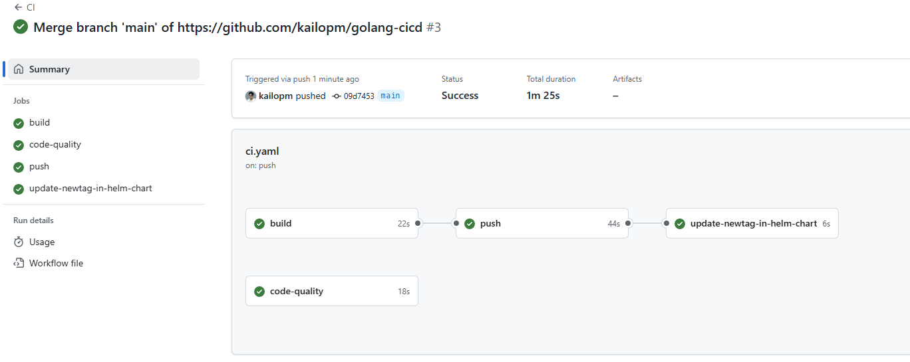
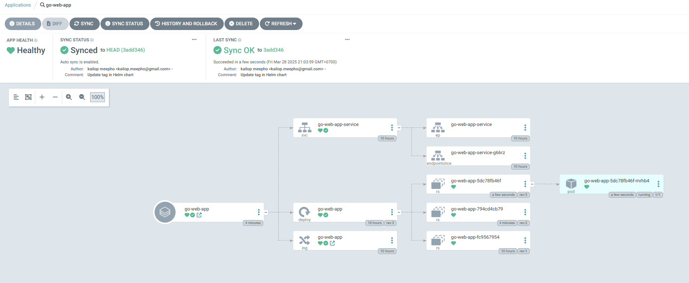
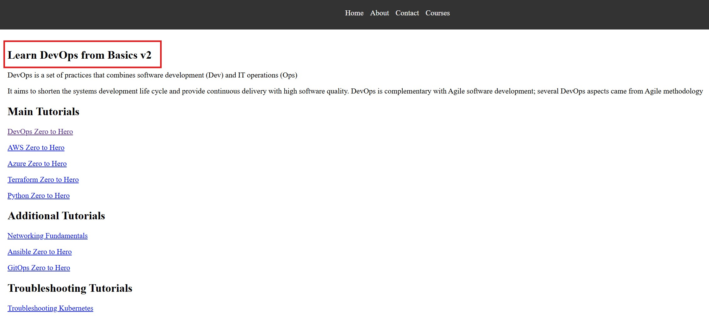

# Introduction
This is the sample project for a Golang app with a full-stream CI/CD pipeline using AWS, Kubernetes, and others.

1. Containerizing the App
2. Create Kubernetes Cluster (EKS)
3. Create Kubernetes Manifest
4. Set up Ingress Controller (Expose My App)
5. Set up Helm Chart for app
6. Set up CI using GitHub Actions
7. Set up CD using GitOps (Argo CD)

# Go Web Application

This is a simple website written in Golang. It uses the `net/http` package to serve HTTP requests.

## Running the server

To run the server, execute the following command:

```bash
go run main.go
```

The server will start on port 8080. You can access it by navigating to `http://localhost:8080/courses` in your web browser.

## Looks like this


# Containerizing the App
Build a golang app
```bash
go build -o main .
./main
```
Multi-stage builds (Best Practices)
```Dockerfile
# Stage 1 - Build main images
# Stage 1 - Build main images
FROM golang:1.22.5 AS base
WORKDIR /app
COPY go.mod .
RUN go mod download
COPY . .
RUN go build -o main .

# Stage 2 - Copy main image into Distroless image
FROM gcr.io/distroless/base
COPY --from=base /app/main .
COPY --from=base /app/static ./static
EXPOSE 8080
CMD ["./main"]
```
Docker Build
```bash
docker login [your_username]
docker build -t [your_username]/go-web-app:v1

# Let's Verify!
docker run -p 8080:8080 -it [your_username]/go-web-app:v1

# Push our images
docker push kailopm/go-web-app:v1

```
# Create Kubernetes Cluster (EKS) (Manually or Terraform)
1. Install eksctl, awscli
2. Create IAM Roles (with given EKS permission)
3. Create Access Key (Profile > Security Credentials)

```bash
# Login into AWS
aws configure

# Create EKS Cluster
eksctl create cluster --name demo-cluster --region ap-southeast-1

# Delete EKS Cluster
eksctl delete cluster --name demo-cluster --region ap-southeast-1
```
After finishing the process of EKS creation (it takes around `15-30` minutes).
We will move forward into the next step.

AWS automatically sets up the Kubernetes configuration `(~/.kube/config)` with the new EKS cluster details. it's `auto-connected` because when you created the EKS cluster using AWS CLI, the update-kubeconfig step was likely done automatically.

# Create Kubernetes Manifest
Create a files
`k8s/manifests/deployment.yaml`
`k8s/manifests/service.yaml`
`k8s/manifests/ingress.yaml`

```bash
kubectl apply -f .
```

For now, we can't access our app using ingress because we don't have an address assigned to the ingress resource.

Next step, we need to create an ingress controller to watch our ingress resource and also add the address into it.

```bash
# Optional to test our app without ingress

# Change ClusterIP > NodePort
kubectl edit svc [service_name]

# If you're using Windows 11 WSL2 and docker, kubernetes installed inside it like me!
kubectl port-forward svc/go-web-app-service 8080:80
navigate to > http://localhost:8080/courses
```

# Set up Ingress Controller (Expose My App)

```bash
# Deploy Ingress Controller for AWS, Using ingress-nginx (not the same as NGINX Ingress Controller by F5)
# Repo --> https://github.com/kubernetes/ingress-nginx
kubectl apply -f https://raw.githubusercontent.com/kubernetes/ingress-nginx/controller-v1.11.1/deploy/static/provider/aws/deploy.yaml
kubectl get pods -n ingress-nginx
kubectl get ing
```

### Recap Our progress 
1. The Ingress resource should have been `assigned` an address from the ingress controller. 
2. The `Load Balancer` should appear in your AWS console.
3. The `Ingress resource address` should be the same as the LB in the AWS console.
4. Our app should still be `unable to access` via LB because the ingress only accepts the `domain go-web-app.local` to be allowed to access.

### Configure DNS Mapping (testing purpose)
```bash
nslookup [LB_ADDRESS]

# Map the DNS
[LB_ADDRESS] go-web-app.local

navigate to > https://go-web-app.local/courses
```

# Set up Helm Chart for app
```bash
mkdir helm
cd helm
helm create go-web-app-chart
cd go-web-app-chart/templates
rm -rf *
cp ../../../k8s/manifests/* .

# Deploy everything using Helm
kubectl delete deploy go-web-app
kubectl delete svc go-web-app-service
kubectl delete ing go-web-app

# Install Helm
helm install go-web-app ./go-web-app-chart/

# Uninstall Helm
helm uninstall go-web-app
```

# Set up CI using GitHub Actions
### CI pipeline
1. Build & Unit Test
2. Static Code Analysis
3. Create & Push Docker Image
4. Update Helm with the image latest tag

Create a file
`.github/workflows/ci.yaml`

Set up Secrets
`Settings > Secrets and variables > Actions > Repository secrets`
Create `DOCKERHUB_USERNAME`
Create `DOCKERHUB_TOKEN`

Time to `Commit!` and see what's going on.

# Set up CD using GitOps (Argo CD)
### CD pipeline
1. Trigger when Helm chart values are changed
2. Install Helm in EKS

```bash
# Create and deploy Argo CD resources
kubectl create namespace argocd
kubectl apply -n argocd -f https://raw.githubusercontent.com/argoproj/argo-cd/stable/manifests/install.yaml

# Access Argo CD UI
kubectl patch svc argocd-server -n argocd -p '{"spec": {"type": "LoadBalancer"}}'
kubectl get svc argocd-server -n argocd
kubectl port-forward svc/argocd-server 8080:80 -n argocd

# Get the password!
kubectl get secrets -n argocd
kubectl edit secrets argocd-initial-admin-secret -n argocd
echo [your_secrets] | base64 --decode

navigate to > [EXTERNAL-IP] (user: admin, )
navigate to new app > Application Name: "go-web-app", Project Name: "defaults", Sync Policy: "automatic", Self Heal, Repository URL: "[your_repo_url]", Path: "[helm_chart_path]", Cluster URL: https://kubernetes.default.svc (that's mean we're deploy into the same EKS Cluster), namespace: "default", VALUES FILES: "values.yaml" > Press "Create"
```

Hooray! For now ours CI/CD is will run automaticlly when the new commit from DEV is come!



